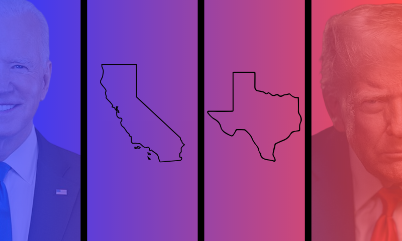

:::{.callout-note}
# A note on amounts and inflation
The numbers for 2020 are adjusted to 2024 dollars to allow direct comparison. 
:::



# What is this story about, and who does it target?

An investigation into how minority-owned businesses in Texas and California are represented in federal contract spending in the last years of the Trump (2020) and Biden (2024) administrations, as well as which agencies are giving the most and least funding between the two states in each year to those businesses, and if that changed between 2020 and 2024.
By looking at Texas and California, this analysis will investigate how an administration may allocate funding differently between states led by different political majorities.

In my preliminary data analysis, California and Texas are quite similar in the categories of agencies that offer the most to minority-owned businesses operating in each state; however, they differ in the number of contracts offered and in how much those numbers change from 2020 to 2024. 

The target audience for this story includes people living in Texas or California, minority business owners in the U.S., and those interested in the federal spending habits of different administrations.

# Why tell this story now, and who does it impact? 

With [political polarization rising](https://www.pewresearch.org/short-reads/2025/07/30/most-americans-say-republican-and-democratic-voters-cannot-agree-on-basic-facts/), DEI being scrutinized in government and institutions across the country, and the second Trump administration [seeking to eliminate DEI-initiatives](https://www.washingtontechnology.com/contracts/2026/05/legislative-proposal-would-eliminate-contracting-preferences-minority-women-owned-businesses/413389/?oref=wt-topic-lander-river) in federal contracting, this story is important now because it offers financial context into how both the Biden and Trump administrations differ in their support for minority-owned businesses in opposing state political climates before the push against DEI became more enforced. 

In fact, there's [evidence](https://www.brookings.edu/articles/federal-policy-shifts-are-reshaping-access-to-capital-and-contracts-for-latino-and-minority-owned-businesses/) that barriers minority-owned businesses face when trying to access federal funding disproportionately hurt those businesses, particularly those owned by Latinos, so [many have sued the Trump administration](https://www.govexec.com/management/2026/04/contractors-sue-block-trumps-federal-dei-executive-order/413013/) over the president's policy that's affecting them. 

Consequently, those primarily affected by this are minority-business owners, though not just in Texas and California, who primarily benefit from federal contracts, as well as the economies of these states that suffer as a result of the decreased capital these businesses have to succeed in their operations. 

This story could offer both a historical precedent for the current Trump administration's actions toward minority-owned businesses and a platform for these business owners to tell their stories about how they've dealt with cuts to their funding. It can also explore how federal contracts may differ not only between administrations with different political majorities but also across the largest states in the contiguous U.S., which also have different political majorities. 

# Potential sources

1.  Minority business owner in Texas or California with federal contracts

2.  Official in the Minority Business Development Agency, part of the Department of Commerce

3.  Economists or scholars at universities studying the intersection of federal funding and DEI policy.

# Preliminary findings and visual

## Minority-owned business contract spending only a fraction of overall contract spending

```{=html}
<iframe title="Minority-owned business contract spending stays below 5% in the two largest states in the contiguous U.S. between 2020 and 2024." aria-label="Stacked Bars" id="datawrapper-chart-gVBXY" src="https://datawrapper.dwcdn.net/gVBXY/3/" scrolling="no" frameborder="0" style="width: 0; min-width: 100% !important; border: none;" height="" data-external="1"></iframe><script type="text/javascript">(function(){function e(){window.addEventListener(`message`,function(e){if(e.data[`datawrapper-height`]!==void 0){var t=document.querySelectorAll(`iframe`);for(var n in e.data[`datawrapper-height`])for(var r=0,i;i=t[r];r++)if(i.contentWindow===e.source){var a=e.data[`datawrapper-height`][n]+`px`;i.style.height=a}}})}e()})();</script>
```

It's important to note that contract spending for minority-owned businesses in Texas and California, while totaling billions of dollars in 2020 and 2024 for both states, represents only a small fraction of overall contract spending in each state. It demonstrates that while much money is being invested in minority-owned businesses in Texas and California, it's barely anything compared to what the government is giving to non-minority-owned businesses. 

## California takes Texas' lead between 2020 and 2024

Texas' decrease in per-capita federal awards issued to minority-owned businesses between 2020 and 2024 paved the way for California to take its spot with its around 23% increase in per-capita federal awards.  

This is notable because it contradicts the assumption that all per-capita federal awards would increase between 2020 and 2024 under the Biden administration, but Texas proves this is not the case. 

```{=html}
<iframe title="California surpasses Texas in federal contract awards amounts given to minority-owned businesses." aria-label="Grouped Bars" id="datawrapper-chart-f6vj7" src="https://datawrapper.dwcdn.net/f6vj7/6/" scrolling="no" frameborder="0" style="width: 0; min-width: 100% !important; border: none;" height="372" data-external="1"></iframe><script type="text/javascript">(function(){function e(){window.addEventListener(`message`,function(e){if(e.data[`datawrapper-height`]!==void 0){var t=document.querySelectorAll(`iframe`);for(var n in e.data[`datawrapper-height`])for(var r=0,i;i=t[r];r++)if(i.contentWindow===e.source){var a=e.data[`datawrapper-height`][n]+`px`;i.style.height=a}}})}e()})();</script>
```


## Defense and national security agencies dominate contracts awarded to minority-owned businesses

The most valuable federal contract awards to minority-owned businesses operating in Texas or California were given by federal agencies related to defense and national security in 2020 and 2024. There are also major differences across categories of agencies in the value of the awards they're offering, such as science, technology, and environment in 2020, and justice, law, and civil rights in 2024. 

Between 2020 and 2024, per-capita contract awards to minority-owned businesses by federal agencies related to defense and national security decreased by 8% in Texas. In California, it increased by 5%. 

```{=html}
<iframe title="Federal agencies related to defense and national security consistently spent more money on contracts with minority-owned businesses operating in Texas than in California" aria-label="Grouped Bars" id="datawrapper-chart-BHG8B" src="https://datawrapper.dwcdn.net/BHG8B/8/" scrolling="no" frameborder="0" style="width: 0; min-width: 100% !important; border: none;" height="" data-external="1"></iframe><script type="text/javascript">(function(){function e(){window.addEventListener(`message`,function(e){if(e.data[`datawrapper-height`]!==void 0){var t=document.querySelectorAll(`iframe`);for(var n in e.data[`datawrapper-height`])for(var r=0,i;i=t[r];r++)if(i.contentWindow===e.source){var a=e.data[`datawrapper-height`][n]+`px`;i.style.height=a}}})}e()})();</script>
```

# How else can this story have multimedia elements?

In terms of data visualizations, more graphs could be made to show how the value of awards to minority-owned businesses differs by county in both states, such as a choropleth map or a treemap, to show the proportion of total spending each category accounts for.

For multimedia elements, a video testimonial from minority business owners who contracted with the federal government, describing their experiences with cuts to their funding, could be powerful, as could a video animation that brings the graphics to life as the columns are drawn. 

# What other information do you need to gather?

For a deeper dive into the minority-owned businesses with the highest total award sums, which are primarily private businesses, I'd need to research them individually to see what kind of business the specific federal agency is contracting the business for, if it's public knowledge, as well as interview or ask these companies for more information about the nature of their relationships with the federal government. 

If I wanted more historical context to compare to just two years, I would get USASpending.gov contract awards records for the end of the first and second Obama administrations (2012 and 2016). 

# Individual analysis example: MVM, Inc. Texas' minority-owned business with the highest sum of contract awards in 2024.

MVM, Inc., is a private security contractor that received awards from the Department of Homeland Security and the Department of Health and Human Services in 2024. Though headquartered in Virginia, it comes up as the highest award recipient because of its operations in Texas.

The private company, which is not required to file SEC reports, has a history of working with [U.S. Immigration and Customs Enforcement](https://revealnews.org/article/ice-gave-185-million-deal-to-defense-contractor-under-investigation-for-housing-kids-in-office/) and the Department of Health and Human Services on immigration, security, and protection services, as well as professional services for federal agencies. 

It [was founded by former secret service agent Dario Marquez](https://dcist.com/story/18/06/21/dc-metro-area-trump-immigration/), who sold it to his son in 2015 but remains as chair and founder. 

# Unaggregated agency spending in both states with total and per capita awards

```{=html}
<iframe title="Federal agency award contracts to minority-owned businesses in Texas and California in 2020 and 2024" aria-label="Table" id="datawrapper-chart-49gPg" src="https://datawrapper.dwcdn.net/49gPg/4/" scrolling="no" frameborder="0" style="width: 0; min-width: 100% !important; border: none;" height="973" data-external="1"></iframe><script type="text/javascript">(function(){function e(){window.addEventListener(`message`,function(e){if(e.data[`datawrapper-height`]!==void 0){var t=document.querySelectorAll(`iframe`);for(var n in e.data[`datawrapper-height`])for(var r=0,i;i=t[r];r++)if(i.contentWindow===e.source){var a=e.data[`datawrapper-height`][n]+`px`;i.style.height=a}}})}e()})();</script>
```

# Possible things to consider/holes

- These are businesses whose "primary place of performance" is either Texas or California, **NOT** that the business is from or headquartered in those states. 
- These only take the years 2020 and 2024 into account, so there may be fluctuations within each administration, i.e., the years between, that might be important to account. 
- Since California and Texas have the largest populations in the country, they might be more immune to federal administrative changes than smaller states whose awards total pale in comparison. 
- Someone else may categorize the agencies differently from me, which would change the calculations for the affected categories. 
- COVID-19 and an under-performing economy. 
- Investigate the categories within the minority-owned businesses label (e.g., Black-owned businesses, women-owned businesses, etc.).

# Estimated delivery

A week or two, depending on how soon sources reach back. It could be more if I decided to go further into the analysis regarding specific minorities, adding more years or adding another state. 

